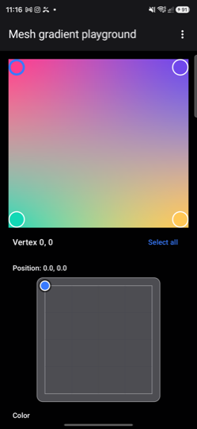
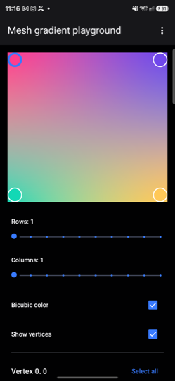
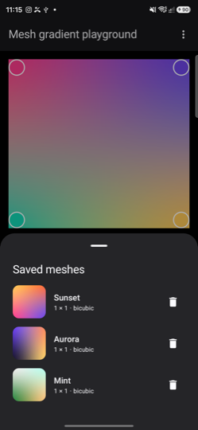
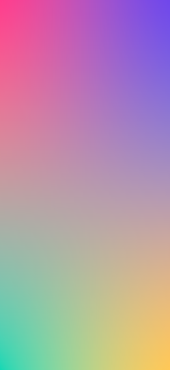

# Mesh Gradient Playground

An Android app for designing mesh gradients with Jetpack Compose's `MeshGradientPainter`, and for
getting the result back out as an image or as the Kotlin that draws it.

| Playground | Control points | Saved meshes | Full screen |
|---|---|---|---|
|  |  |  |  |

## What it does

| | |
|---|---|
| 🎛 **Direct editing** | Drag vertices on the canvas, or select one — or several — and set values from the panel. The gradient stays in view the whole time. |
| 🔲 **Up to 10 × 10 patches** | Resize the grid at any point, with bilinear or bicubic colour interpolation. |
| 🎨 **Colour per vertex** | Red, green, blue and alpha sliders, over a checkerboard swatch so transparency reads. |
| 🪝 **Bézier control points** | Four tangents per vertex, edited as *offsets* on a zero-centred pad. Switching one on seeds the tangent the renderer already inferred, so the gradient never jumps. |
| 💾 **Save and reopen** | Named meshes kept as JSON, listed with live thumbnails rendered from the mesh itself. |
| 🖥 **Full screen** | The gradient alone — no chrome, no markers, no system bars. Back returns. |
| 🖼 **Share as PNG** | The gradient at canvas resolution, markers excluded. |
| 📋 **Share painter code** | The `MeshGradientPainter` call that reproduces the mesh, ready to paste. |

## Bundled meshes

`DefaultMeshes.kt` holds the meshes copied into a fresh install. It is a plain
`List<MeshPreset>` — add entries there to ship more. They are seeded on first launch and behave
like any saved mesh afterwards, so editing or deleting one sticks, and new defaults reach fresh
installs only.

## A note on coordinates

Vertex positions and control points are normalized: `(0, 0)` is the top left of the drawing bounds
and `(1, 1)` the bottom right. Two things follow that are easy to trip over:

- The mesh paints **only** the area its vertices span. Pull a vertex inward and the space outside
  is left transparent, not stretched to fill.
- Positions outside `0..1` are legal and useful — pushing a corner out to `(-0.4, -0.4)` keeps the
  bounds covered while moving that colour's centre off-canvas. The app's editor clamps to `0..1`,
  but meshes written in `DefaultMeshes.kt` are not clamped.

## Licence

MIT — see [LICENSE](LICENSE).
